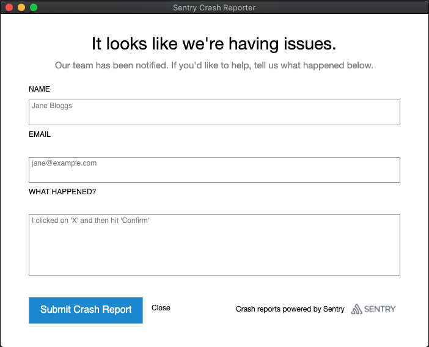

# Sentry Crash Reporter

_This is very much a WIP_

Cross platform Desktop Crash Reporter for Sentry.

> Windows, macOS and Linux.

If you require requesting a user's consent before uploading a a crash report, this project might be for you.

An application using Sentry can be configured to write the crash to disk and spawn this Desktop app.
The app can ask for further information from the user, and have them decide whether to submit the crash or not.

For transparency, all the data sent to Sentry can also be displayed to the user, before they need to decide how to proceed.



> Is this interesting to you? Please raise an issue to discuss it.

Run in development:
```
dotnet run
```

Build for publishing:
```
dotnet publish -c release -r osx-x64
```